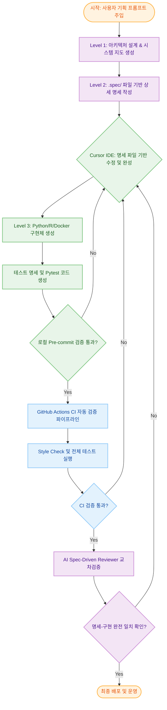

# AI4RADMED

이 프로젝트는 **AI4RADMED 브랜드의 공통 인프라(보안, 데이터베이스, 아이덴티티 관리 등)**를 구축하고 관리하기 위한 오픈소스 플랫폼입니다. 병원 내부망 및 폐쇄망 환경에서도 안정적으로 동작하는 의료향 PaaS(Platform-as-a-Service)를 지향합니다.

---

## AI Software Development Life Cycle (AI-SDLC)

본 프로젝트는 기획 단계부터 배포까지 AI 에이전트와의 적극적인 협업을 통해 높은 품질과 생산성을 보장하는 **AI-Native Spec-Driven Development** 워크플로우를 채택하고 있습니다. 명세(`.spec/`)를 중심으로 구현과 검증이 순환하는 자동화된 파이프라인 개발 경험을 제공합니다.

### 개발 워크플로우 및 검증 루프

1.  **AI 기획 및 설계 (AI Planning)**: [AGENTS.md](../AGENTS.md)를 통해 시스템 지도를 먼저 정의하고, 모든 구현체 전에 `.spec/` 디렉토리에 명세를 먼저 작성합니다.
2.  **명세 주도 개발 (Spec-Driven)**: 작성된 명세 파일을 AI 에이전트(Gemini, Claude 등)에게 전달하여 명세의 디테일을 완성합니다. 완성된 명세를 바탕으로 1:1로 매칭되는 실행 파일을 생성한 뒤, Pytest를 위한 테스트 명세 및 실제 테스트 코드를 작성합니다. 테스트를 통과해야만 구현이 완료된 것으로 간주합니다.
3.  **CI 검증 & AI 교차 리뷰 (CI & AI Review)**: 코드가 푸시되면 CI 파이프라인에서 `make test` 등이 진행됩니다. 모든 테스트를 통과하면 마지막으로 **AI Spec-Driven Reviewer**가 명세와 구현의 일치 여부를 교차 검증합니다.

---

## 핵심 기능 및 설계 철학

### 🔐 의료 데이터급 보안 인프라
- **12 Pillars of World Class Security**: 제로 트러스트(Zero Trust), 시크릿 관리(Vault), 통합 인증(Keycloak/OIDC) 등 의료 인프라에 필수적인 보안 요구사항을 기본으로 갖춥니다.
- **Fail Loudly**: 장애 발생 시 침묵하지 않고 맥락(Context)을 포함한 상세 로그를 남겨 즉각적인 대응이 가능하도록 합니다.

### 🏗️ 플러그인 기반 확장성 (Plug-in Architecture)
- **Apps & Extensions**: `Cortex-M`, `Dose Optimizer`, `NMIQ` 등 다양한 의료 앱을 플랫폼 위에 쉽게 올릴 수 있는 마이크로서비스 구조를 제공합니다.
- **인프라 공유**: 공통 데이터베이스(Postgres), 보안 엔진(Vault), 이미지 서버(Orthanc) 리소스를 각 앱이 안전하게 격리된 상태로 공유합니다.

---

## 기술 스택 및 프로젝트 구조

### 주요 기술
- **Backend/Scripts**: Python 3.x (uv), R (renv)
- **Infrastructure**: Docker Compose, PostgreSQL (TLS), HashiCorp Vault, Keycloak, OpenResty (OIDC)
- **Quality**: Pytest, ShellCheck, Makefile-based Workflow

### 프로젝트 구조

| 경로 | 설명 |
| ----------------- | ---------------------------------------------- |
| `src/` | 주요 엔진 로직 및 공통 유틸리티 (Python/R) |
| `scripts/` | 설치, 셋업, 백업 등 자동화 관리 스크립트 |
| `templates/` | 서비스별 Docker Compose 및 설정 템플릿 |
| `config/` | 서비스 활성화 및 인프라 매개변수 설정 |
| `documents/` | 개발 가이드 및 상세 기술 명세서 |
| `.spec/` | 파일별 1:1 대응 명세서 (Agent용) |
| `tests/` | 단위(Unit), 통합(Integration), 보안 검증 테스트 |

---

## 상세 가이드 및 유지보수 참조 (Maintenance Documents)

상세한 운영 및 서비스별 설정 방법은 `documents/` 내의 개별 문서를 참조하십시오.

### 인프라 및 보안
- **[운영 가이드](operations.md)**: WSL2 최적화, 오프라인 배포 및 자동 구동 전략
- **[보안 구현 계획](security-implementation-plan.md)**: 12 Pillars 구현 현황 및 보안 검증 체크리스트
- **[Vault 서비스 가이드](vault.md)**: 시크릿 관리 및 자동 언실(Auto-unseal) 설정

### 서비스별 가이드
- **[PostgreSQL 가이드](postgres.md)**: DB 계정 관리 및 2-Step TLS 적용 방법
- **[Orthanc PACS 가이드](orthanc.md)**: 3-Tier PACS 아키텍처 및 이미지 워크플로우
- **[Keycloak/OIDC 가이드](keycloak.md)**: 통합 인증 및 제로 트러스트 게이트웨이 연동

---

## 라이선스 및 이용 안내

본 프로젝트는 의료 인프라의 표준화와 AI 기반 개발 표준 확산을 위해 공개되었습니다.

- **비상업적 목적**: 교육 및 연구 용도의 활용은 자유롭게 허용됩니다.
- **상업적 목적**: 본 프로젝트의 아키텍처 또는 코드를 상업적 서비스에 인용하거나 재배포할 경우 사전 협의가 필요합니다.
