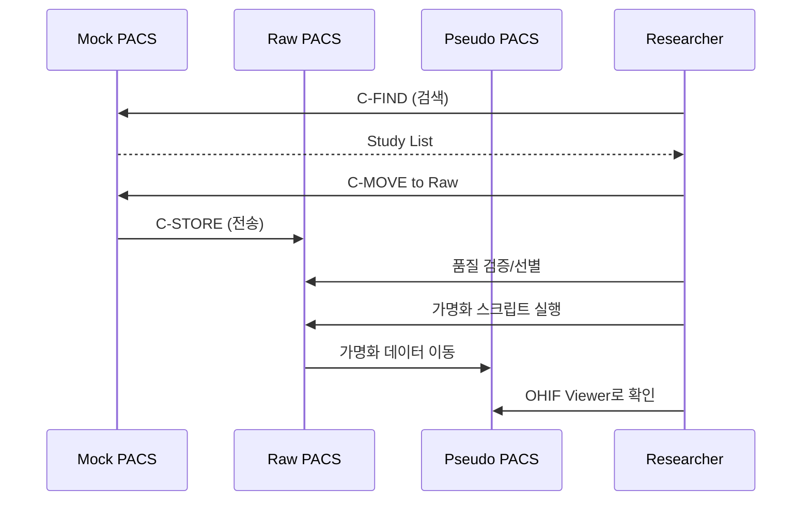

# Orthanc Service Guide

> **Orthanc**는 경량화된 오픈소스 DICOM 서버(PACS)입니다. 
> `ai4infra` 프로젝트에서는 의료 영상 연구를 위한 **3-Tier PACS Architecture**를 제공합니다.

## 1. Architecture Overview

### 🏗️ 3-Tier PACS Structure (Mock → Raw → Pseudo)

```
┌──────────────┐      ┌──────────────┐      ┌──────────────┐
│  Mock PACS   │ ───▶ │   Raw PACS   │ ───▶ │ Pseudo PACS  │
│              │      │              │      │              │
│ 병원 모사     │      │ 선별/전처리   │      │ 가명화/연구   │
│ orthanc_mock │      │ orthanc_raw  │      │orthanc_pseudo│
└──────────────┘      └──────────────┘      └──────────────┘
```

#### 1. **Mock PACS** (병원 원본 모사)
- **역할**: 실제 병원 PACS를 모사한 원본 데이터 저장소
- **AET**: `MOCK_PACS`
- **DB**: `orthanc_mock`
- **포트**: DICOM `4243`
- **도메인**: `pacs-mock.ai4infra.internal`
- **용도**: C-FIND/C-MOVE로 연구에 필요한 데이터 검색 및 다운로드

#### 2. **Raw PACS** (원시 데이터)
- **역할**: Mock에서 가져온 데이터의 품질 검증 및 선별 (Curation)
- **AET**: `RAW_PACS`
- **DB**: `orthanc_raw`
- **포트**: DICOM `4244`
- **도메인**: `pacs-raw.ai4infra.internal`
- **용도**: 가명화 전 원시 데이터 임시 보관 및 전처리

#### 3. **Pseudo PACS** (가명화 데이터)
- **역할**: 개인정보가 제거된 연구용 데이터 저장소
- **AET**: `PSEUDO_PACS`
- **DB**: `orthanc_pseudo`
- **포트**: DICOM `4245`
- **도메인**: `pacs-pseudo.ai4infra.internal`
- **용도**: 연구자에게 제공되는 최종 데이터셋

### 🔧 Technical Components
- **Container**: `jodogne/orthanc-plugins:1.12.1`
- **Database**: PostgreSQL (서비스별 독립 DB)
- **Storage**: 로컬 파일시스템 (서비스별 독립 볼륨)
- **Gateway**: Nginx 리버스 프록시
- **Viewer**: OHIF Viewer 플러그인

### 4.2 Native Environment Substitution
과거에는 `entrypoint.sh`와 `sed`를 사용하여 환경변수를 설정 파일에 주입했으나, 최신 Orthanc(1.5.0+)의 **Native Environment Substitution** 기능을 활용하여 구조를 단순화했습니다.

1.  **JSON Template**: `${VAR_NAME}` 문법을 그대로 사용합니다.
2.  **Docker Compose**: `.env` 파일을 통해 환경변수를 컨테이너에 전달합니다.
3.  **No Scripts**: 별도의 `entrypoint.sh` 없이 Orthanc가 직접 설정 파일을 읽습니다.

**보안 이점:**
비밀번호(DB Password 등)가 파일 시스템(`/tmp/config`)에 평문으로 저장되지 않고, 오직 프로세스 메모리 내에서만 치환되어 보안성이 향상됩니다.

---

## 2. Installation

### 3-Tier PACS Stack (Standard)
```bash
make install-pacs-stack
```

### Individual Service
```bash
# 개별 설치
python scripts/ai4infra/ai4infra-cli.py install orthanc-mock
python scripts/ai4infra/ai4infra-cli.py install orthanc-raw
python scripts/ai4infra/ai4infra-cli.py install orthanc-pseudo
```

**자동 처리 사항**:
- PostgreSQL DB 및 사용자 생성 (서비스별)
- Docker 네트워크 연결
- Nginx 설정 복사 및 재시작
- 헬스 체크 및 로그 검증

---

## 3. Configuration

### Environment Variables (`.env`)
```bash
# 공통
ORTHANC_ADMIN_PASSWORD=your_password
ORTHANC_DB_PASSWORD=your_db_password

# 서비스별 (자동 생성)
ORTHANC_AET=ORTHANC          # 기본
ORTHANC_DB_NAME=orthanc      # 기본
```

### 3.1 AETitle Configuration (DicomAet)
> **중요**: Orthanc 자신의 AETitle을 설정할 때는 `AETitle`이 아닌 **`DicomAet`** 키를 사용해야 합니다. (`AETitle`은 원격 장비를 정의할 때 사용됨)

- **설정 위치**: `config/<service>.yml`
- **적용 원리**: 
    1. 사용자가 `yml` 파일에 `ORTHANC_AET` 변수를 정의합니다.
    2. `docker-compose`가 이를 컨테이너의 환경변수로 주입합니다.
    3. **Orthanc Native Substitution**: Orthanc(1.5.0+)가 `orthanc.json`의 `${ORTHANC_AET}` 구문을 스스로 해석하여 적용합니다. (별도의 entrypoint 스크립트 불필요)

**설정 예시 (`config/orthanc-mock.yml`):**
```yaml
entry_vars:
  ORTHANC_AET: "MOCK_PACS" # 밑줄(_) 사용 가능
  ORTHANC__NAME: "AI4INFRA MOCK PACS"
```

**템플릿 예시 (`templates/orthanc-mock/orthanc.json`):**
```json
{
    "Name": "${ORTHANC__NAME}",
    "DicomAet": "${ORTHANC_AET}",  // <-- Critical: Use "DicomAet", not "AETitle"
    ...
}
```

### Service Config (`config/orthanc-*.yml`)
각 서비스는 독립된 설정 파일을 가집니다:
- `orthanc-mock.yml` (Mock PACS)
- `orthanc-raw.yml` (Raw PACS)
- `orthanc-pseudo.yml` (Pseudo PACS)
*(orthanc.yml for single instance has been removed)*

**주요 설정**:
```yaml
env_vars:
  ORTHANC_AET: "MOCK_PACS"        # [DICOM] 통신용 ID (중요)
  ORTHANC__NAME: "My Hospital"    # [WEB] 브라우저 상단 표시 이름 (장식용)
  ORTHANC_DB_NAME: "orthanc_mock" # Database name
  ORTHANC__POSTGRESQL__DATABASE: "orthanc_mock"

compose_vars:
  ORTHANC_DICOM_PORT: "4243"      # 호스트 포트 매핑
  ORTHANC_MEM_LIMIT: "1g"
```

---

## 4. Usage

### 🌐 Web Access
| Service | URL | Credentials |
|---------|-----|-------------|
| Mock | `http://pacs-mock.ai4infra.internal` | admin / `.env` 참조 |
| Raw | `http://pacs-raw.ai4infra.internal` | admin / `.env` 참조 |
| Pseudo | `http://pacs-pseudo.ai4infra.internal` | admin / `.env` 참조 |
| 기본 | `http://pacs.ai4infra.internal` | admin / `.env` 참조 |

### 📡 DICOM Access
| Service | AET | Port |
|---------|-----|------|
| Mock | MOCK_PACS | 4243 |
| Raw | RAW_PACS | 4244 |
| Pseudo | PSEUDO_PACS | 4245 |
| 기본 | ORTHANC | 4242 |

### 💻 DICOM Operations Example
```bash
# C-ECHO (연결 테스트)
dcmtk echoscu -v localhost 4243 -aet CLIENT -aec MOCK_PACS

# C-FIND (Study 검색)
dcmtk findscu -v localhost 4243 -aet CLIENT -aec MOCK_PACS \
  -k QueryRetrieveLevel=STUDY \
  -k PatientID="*" \
  query.dcm

# C-MOVE (데이터 전송)
dcmtk movescu -v localhost 4243 -aet CLIENT -aec MOCK_PACS \
  +P 4244 -aem RAW_PACS \
  -k QueryRetrieveLevel=STUDY \
  -k StudyInstanceUID="1.2.3..."
```

---

## 5. Typical Workflow (연구 데이터 수집)



**단계별 설명**:
1. **Search & Download**: Mock에서 필요한 Study 검색 후 Raw로 이동
2. **Curation**: Raw에서 품질 검증 및 불필요한 데이터 제거
3. **De-identification**: DICOM 태그에서 개인정보 제거
4. **Final Storage**: Pseudo에 최종 데이터셋 저장
5. **Research**: Pseudo의 OHIF Viewer로 연구 진행

---

## 7. dcmtk (Infrastructure Service)

> **Container**: `ai4infra-dcmtk:latest` (DCMTK 도구 세트)

연구 자동화 및 데이터 이동을 위해 DCMTK 도구가 설치된 독립 컨테이너를 제공합니다.

### 🚀 Installation
```bash
python scripts/ai4infra/ai4infra-cli.py install dcmtk
```

### 📖 Usage
- **Example Scripts**: `/examples/` 폴더에 기본 연동 스크립트가 포함되어 있습니다.
- **Custom Scripts**: `workspace/` 폴더에 자체 스크립트를 작성하여 실행할 수 있습니다.

상세 내용은 `templates/dcmtk/README.md`를 참조하십시오.

---

## 8. Troubleshooting
- **`502 Bad Gateway`**: Orthanc 컨테이너는 떴으나 내부 서비스(8042 포트)가 아직 준비되지 않았을 수 있습니다. 약 10~30초 후 다시 시도하십시오.
- **`fe_sendauth: no password supplied`**: Entrypoint 스크립트가 환경변수를 제대로 치환하지 못했음. `.env` 파일이 올바르게 로드되었는지 확인.

### `Plugin ... No available configuration`
- **원인**: `orthanc.json`에서 `Plugins` 경로 리스트가 누락됨.
- **해결**: `["/usr/share/orthanc/plugins", ...]` 추가.

### `HTTP 404 Not Found` (Nginx)
- **원인**: Nginx 설정 파일(`orthanc.conf`)이 컨테이너에 없거나 오타.
- **해결**: `make install-orthanc`를 다시 실행하여 설정 파일을 복사하고 Nginx 리로드.

---

## 9. References
- **Official Configuration Guide**: [The Orthanc Book - Configuration](https://orthanc.uclouvain.be/book/users/configuration.html)
- **DICOM AETitle**: [The Orthanc Book - DicomAet](https://orthanc.uclouvain.be/book/users/configuration.html#dicomaet)
